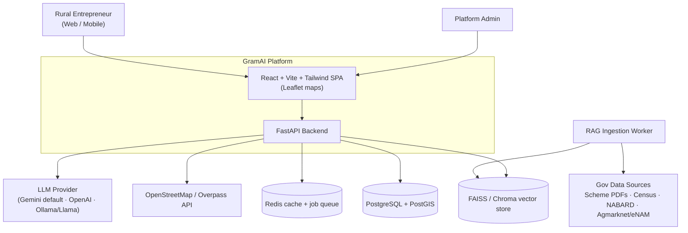
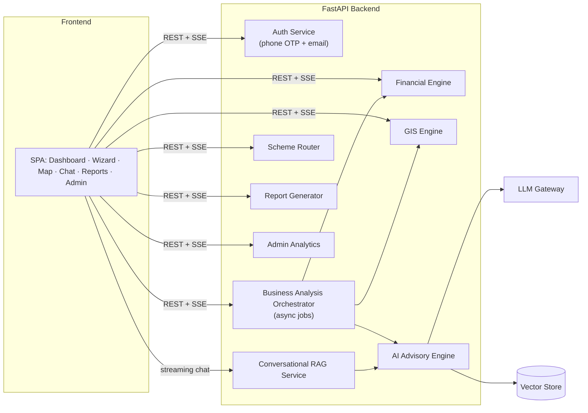
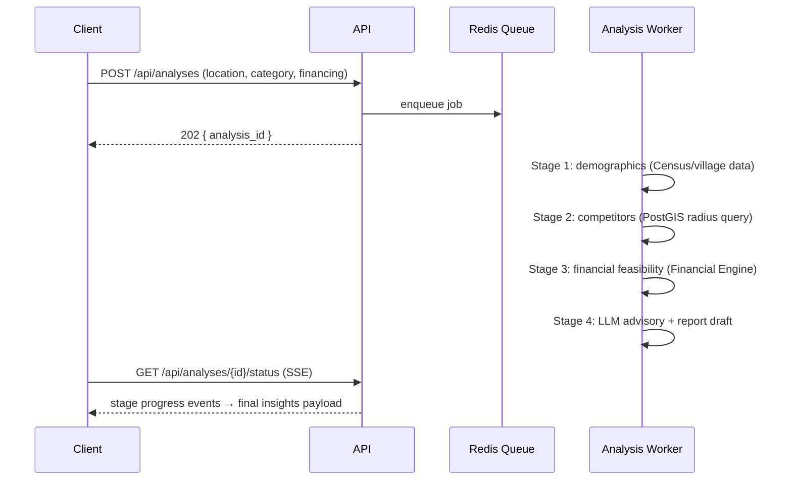
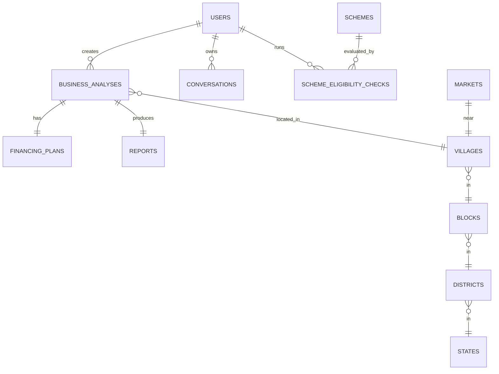
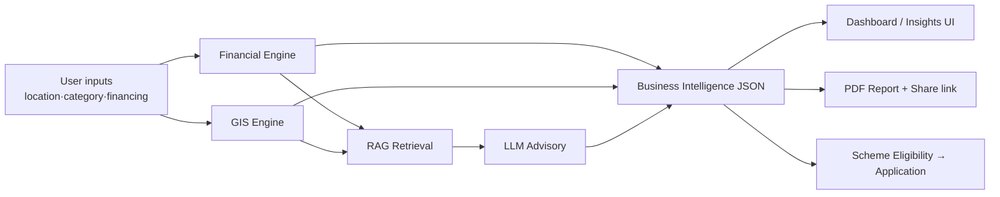

# GramAI — AI Rural Business Intelligence Platform
## Complete System Architecture (SIH 2026)

> Merges the SIH architecture brief with the 13 Stitch UI screens in
> `stitch_gramai_rural_intelligence_platform/`. Every screen is mapped to backend
> services, APIs, and data models.

---

## 1. System Overview

GramAI helps rural entrepreneurs evaluate business ideas, understand loan
eligibility, get hyper-local market intelligence, and route into government
schemes — multilingual (EN / हिंदी / मराठी / தமிழ்), map-driven, and report-centric.

### 1.1 Context Diagram (C4 Level 1)



### 1.2 Container Diagram (C4 Level 2)



---

## 2. Screen → Service Mapping

Every Stitch screen mapped to its backing endpoints:

| # | Stitch Screen | Purpose | Required APIs |
|---|---------------|---------|---------------|
| 1 | `welcome_to_gramai` | Landing + language select (EN/HI/MR/TA) | `GET /api/i18n/{lang}` |
| 2 | `login_gramai` | Login/Register tabs, phone OTP modal, Google sign-in | `POST /api/auth/register`, `POST /api/auth/otp/send`, `POST /api/auth/otp/verify`, `POST /api/auth/login`, `POST /api/auth/google` |
| 3 | `dashboard_gramai` | Viability ring (85%), recent reports, schemes carousel | `GET /api/users/me/dashboard`, `GET /api/reports?limit=5`, `GET /api/schemes?recommended=true` |
| 4 | `new_business_analysis` | 4-step wizard: location → category → financing → review; GPS detect; sliders (project cost ₹1L–₹50L, margin %, rate, tenure); live EMI | `GET /api/geo/locations`, `GET /api/business/categories`, `POST /api/finance/quote` (live EMI preview), `POST /api/analyses` |
| 5 | `ai_is_analyzing` | 4-stage progress stepper + fun facts | `GET /api/analyses/{id}/status` (SSE stream of stages) |
| 6 | `business_insights` | Viability score, loan eligibility summary (MUDRA tier, EMI), YoY growth, competitor count, price-comparison chart, risk profile, subsidy cross-sell | `GET /api/analyses/{id}/insights`, `GET /api/schemes/eligibility/{analysis_id}` |
| 7 | `business_report_preview` | Full report: exec summary, SWOT, 3-yr projections; Download PDF / Share with Bank | `GET /api/reports/{id}`, `GET /api/reports/{id}/pdf`, `POST /api/reports/{id}/share` |
| 8 | `financial_planning` | Loan simulator sliders, amortization table, break-even chart, expense donut, cash-flow forecast | `POST /api/finance/simulate`, `GET /api/finance/amortization/{plan_id}` |
| 9 | `market_analysis_map` | Leaflet map, radius toggle 5/10/25 km, POI layers (markets/competitors/suppliers), "Generate Report from View" | `GET /api/geo/nearby`, `POST /api/reports/from-view` |
| 10 | `government_schemes` | Scheme detail (PMMY): tiers Shishu/Kishore/Tarun, eligibility criteria, required documents | `GET /api/schemes/{slug}`, `POST /api/schemes/check-eligibility` |
| 11 | `gramai_assistant` | Conversation list, chat with inline charts in answers, export | `GET /api/chat/conversations`, `POST /api/chat` (streaming), `GET /api/chat/conversations/{id}/export` |
| 12 | `my_profile` | Profile completeness, saved analyses, activity feed, settings | `GET/PATCH /api/users/me`, `GET /api/users/me/activity` |
| 13 | `admin_console` | KPIs (users, reports, ₹ loans facilitated, uptime), usage charts, users table, audit log | `GET /api/admin/metrics`, `GET /api/admin/users`, `GET /api/admin/audit-log` |

---

## 3. Backend Module Design

### 3.1 Auth Service
- **Phone-first auth** (rural users): mobile + OTP via SMS gateway (MSG91/Twilio).
- JWT access (15 min) + refresh tokens (30 d). Optional Google OAuth.
- Roles: `user`, `admin`.

### 3.2 Business Analysis Orchestrator
Async job pipeline matching the "AI is Analyzing" stepper:



Implementation: Celery/RQ workers on Redis; stage status persisted on the
`business_analyses` row (`stage`, `progress_pct`). SSE preferred over WebSocket
(simpler, proxy-friendly).

### 3.3 Financial Engine (pure Python, deterministic)
Inputs: project cost, own contribution (margin %), rate, tenure, moratorium.
Outputs:
- Loan = cost × (1 − margin%)
- EMI = $P \cdot r \frac{(1+r)^n}{(1+r)^n - 1}$ where $r$ = monthly rate, $n$ = months
- Amortization schedule (principal/interest/balance per month)
- Moratorium period handling (interest-only during moratorium)
- Working capital estimate, break-even point, 3-yr cash-flow projection
- Scheme tier routing (e.g., MUDRA Shishu < ₹50k, Kishore ₹50k–₹5L, Tarun ₹5L–₹10L)

No LLM involved — fully testable with unit tests.

### 3.4 GIS Engine
- Location hierarchy seeded from Census/LGD codes: State → District → Block(Taluka) → Village.
- POI data from OpenStreetMap via Overpass API (shops, markets, mandis), cached in PostGIS.
- Queries: `ST_DWithin(geom, ST_MakePoint(lon,lat)::geography, radius)` for
  markets / competitors / suppliers by layer and radius (5/10/25 km).
- Competitor density = count per category within radius; feeds viability scoring.

### 3.5 AI Advisory Engine
- **LLM Gateway**: provider-adapter pattern — Gemini (default, free tier,
  strong Indic-language support), OpenAI, or self-hosted Llama via Ollama.
- Structured outputs (JSON mode) for: SWOT, opportunity analysis, threat
  detection, pricing strategy, viability score (0–100 weighted model:
  demand 30%, competition 20%, financials 25%, scheme fit 15%, risk 10%),
  growth roadmap.
- All numeric claims come from Financial/GIS engines — LLM only narrates and
  interprets (prevents hallucinated figures).

### 3.6 Conversational RAG Service
Pipeline: `User query → intent classify → retriever → vector store (top-k) →
LLM → response`.
- Responses are **rich payloads**: `{ text, charts?: [{type:"bar", series:[...]}] }`
  so the assistant UI can render inline charts (per `gramai_assistant` screen).
- Streaming via SSE; conversations persisted per user.
- Vector store: Chroma (dev) / FAISS (prod index); embeddings via Gemini
  text-embedding or multilingual-e5 (Indic support).

### 3.7 Scheme Router
- Schemes stored as structured records: eligibility rules (JSONLogic),
  loan range, interest guidance, required documents, tiers.
- Eligibility check = rule evaluation against user profile + analysis
  financing params → ranked matches ("you qualify for 2 additional state subsidies").

### 3.8 Report Generator
- Report = versioned JSON document (exec summary, SWOT, financials, market
  section, roadmap).
- PDF via WeasyPrint (HTML template using DESIGN.md tokens) or ReportLab.
- Share links: signed expiring URLs ("Share with Bank").

### 3.9 Admin Analytics
- Aggregated metrics (users, reports, loans facilitated, uptime), usage time
  series, user management, audit log of every LLM call/query.

---

## 4. Data Model (PostgreSQL + PostGIS)



Key tables:

```sql
users(id PK, full_name, mobile UNIQUE, email, password_hash, role,
      preferred_lang, profile_completeness, created_at)

states(id PK, name, lgd_code)
districts(id PK, state_id FK, name, lgd_code)
blocks(id PK, district_id FK, name, lgd_code)
villages(id PK, block_id FK, name, lgd_code,
         geom GEOGRAPHY(Point,4326), population, census_data JSONB)

business_categories(id PK, slug, name, name_hi, name_mr, name_ta, icon)

business_analyses(
  id PK UUID, user_id FK, village_id FK, category_id FK,
  status ENUM(created,running,completed,failed),
  stage TEXT, progress_pct SMALLINT,
  viability_score NUMERIC, insights JSONB,   -- SWOT, pricing, risks, charts
  created_at, completed_at)

financing_plans(
  id PK, analysis_id FK, project_cost NUMERIC, margin_amount NUMERIC,
  margin_pct NUMERIC, loan_amount NUMERIC, interest_rate NUMERIC,
  tenure_months INT, moratorium_months INT DEFAULT 0,
  emi NUMERIC, schedule JSONB, break_even_month INT, cashflow JSONB)

schemes(id PK, slug UNIQUE, name, level ENUM(central,state),
        min_loan, max_loan, interest_guidance TEXT, tier TEXT,
        eligibility_rules JSONB,      -- JSONLogic
        documents_required TEXT[], description_md, source_url)

scheme_eligibility_checks(id PK, user_id FK, scheme_id FK,
        eligible BOOL, reasons JSONB, checked_at)

markets(id PK, name, type ENUM(market,mandi,wholesale),
        village_id FK, geom GEOGRAPHY(Point,4326))
competitors(id PK, name, category_id FK, osm_ref,
            village_id FK, geom GEOGRAPHY(Point,4326))

reports(id PK, analysis_id FK, version INT, content JSONB,
        pdf_path TEXT, share_token TEXT NULL, share_expires_at TIMESTAMPTZ NULL)

conversations(id PK, user_id FK, title, created_at)
messages(id PK, conversation_id FK, role ENUM(user,assistant),
         content JSONB,               -- {text, charts[]}
         created_at)

audit_logs(id PK, user_id FK NULL, action TEXT, detail JSONB, created_at)
```

Indexes: GiST on all `geom` columns; `(user_id, created_at DESC)` on analyses;
GIN on `schemes.eligibility_rules`.

---

## 5. API Specification

Base: `/api` · Auth: `Authorization: Bearer <JWT>` unless noted.

### Auth
| Method | Path | Body → Response |
|---|---|---|
| POST | `/auth/otp/send` | `{mobile}` → `{ok, resend_in:45}` |
| POST | `/auth/otp/verify` | `{mobile, otp}` → `{access_token, refresh_token, is_new_user}` |
| POST | `/auth/register` | `{full_name, mobile, lang}` |
| POST | `/auth/login` | `{email\|mobile, password}` → tokens |
| POST | `/auth/google` | `{id_token}` → tokens |

### Analyses
```http
POST /api/analyses
{
  "village_id": 4821,            // or {"lat": 18.58, "lon": 73.95}
  "category_slug": "retail",
  "financing": {
    "project_cost": 1000000,
    "margin_pct": 25,
    "interest_rate": 9.5,
    "tenure_months": 60,
    "moratorium_months": 6
  }
}
→ 202 { "analysis_id": "uuid", "status": "queued" }

GET /api/analyses/{id}/status        # SSE: stage events
event: stage
data: {"stage":"demographics","progress":25,"label_i18n_key":"stage.demographics"}
...
data: {"stage":"done","viability_score":88}

GET /api/analyses/{id}/insights
→ {
  "viability_score": 88,
  "loan_eligibility": {"scheme":"MUDRA","tier":"Shishu","emi":4500},
  "market": {"yoy_growth_pct":14,"competitors_within_10km":2},
  "pricing": {"competitor_price":45,"recommended_price":65},
  "risk_profile": {...}, "swot": {...},
  "additional_subsidies_eligible": 2
}
```

### Finance
```http
POST /api/finance/quote     # live wizard EMI preview (no persistence)
{ "project_cost":1000000, "margin_pct":25, "interest_rate":9.5, "tenure_months":60 }
→ { "loan_amount":750000, "emi":15750, "total_interest":195000 }

POST /api/finance/simulate  # full simulator: schedule, break-even, cashflow, donut
GET  /api/finance/amortization/{plan_id}   # repayment schedule rows
```

### Geo
```http
GET /api/geo/locations?state=&district=&block=       # cascading selects
GET /api/geo/nearby?village_id=4821&radius_km=10&layers=markets,competitors,suppliers
→ { "center":{"lat":..,"lon":..},
    "pois":[{"layer":"competitor","name":"AgriPlus","lat":..,"lon":..}],
    "density":{"competitors_per_km2":0.04} }
```

### Schemes
```http
GET  /api/schemes?recommended=true&lang=hi
GET  /api/schemes/{slug}?lang=en          # detail: tiers, docs, notes
POST /api/schemes/check-eligibility
{ "analysis_id":"uuid" } → [{ "scheme":"PMMY","eligible":true,"tier":"Kishore","reasons":[...] }]
```

### Chat
```http
POST /api/chat          # SSE streaming
{ "conversation_id":"uuid|null", "message":"Why did my market share dip?", "analysis_id":"uuid" }
event: token  data: {...}
event: chart  data: {"type":"bar","series":[{"month":"May","value":4.1},...]}
event: done   data: {"message_id":"..."}

GET /api/chat/conversations
GET /api/chat/conversations/{id}/export?format=pdf
```

### Reports
```http
GET  /api/reports?limit=5
GET  /api/reports/{id}
GET  /api/reports/{id}/pdf
POST /api/reports/{id}/share      → { "url":"https://.../s/<token>", "expires_in_days":30 }
POST /api/reports/from-view       # "Generate Report from View" on map screen
{ "village_id":..., "radius_km":10, "layers":["markets","competitors"] }
```

### Users / Admin / i18n
```http
GET  /api/users/me/dashboard   # score ring, recent reports, scheme carousel
PATCH /api/users/me            # name, lang, theme, notifications
GET  /api/users/me/activity
GET  /api/admin/metrics        # users, reports, loans_facilitated, uptime, usage_series
GET  /api/admin/users?region=&status=
GET  /api/admin/audit-log
GET  /api/i18n/{lang}          # EN/HI/MR/TA bundles
```

---

## 6. Frontend Architecture

```
src/
├── app/                 # router, providers (auth, i18n, theme)
├── features/
│   ├── auth/            # login/register tabs, OTP modal
│   ├── dashboard/       # viability ring, report list, scheme carousel
│   ├── wizard/          # 4-step analysis wizard (stepper)
│   ├── analyzing/       # SSE-driven progress screen
│   ├── insights/        # score cards, price charts, risk
│   ├── finance/         # simulator, amortization table, donuts
│   ├── map/             # Leaflet, radius toggles, POI layers
│   ├── schemes/         # list + detail + eligibility checker
│   ├── assistant/       # chat UI rendering rich payloads
│   ├── reports/         # preview, PDF download, share
│   └── admin/
├── lib/api.ts           # typed fetch client (OpenAPI-generated)
├── i18n/                # en.json hi.json mr.json ta.json
└── design/tokens.ts     # from DESIGN.md
```

- **State:** TanStack Query (server state) + Zustand (wizard/session state).
- **Maps:** react-leaflet; Overpass POIs rendered as custom SVG pins with popovers.
- **i18n:** every API accepting `lang`; LLM responses requested in user's language.
- **Design system (DESIGN.md):** Inter font; primary `#2563eb`, green `#006e2f`,
  orange `#996100`; glassmorphic modals (`blur(12px)`); 16px card radius;
  8px grid; sparkline stat cards; 2px-stroke charts with gradient fills.

---

## 7. Repository Layout (Monorepo)

```
gramai/
├── frontend/                  # React + Vite + Tailwind
├── backend/
│   ├── app/
│   │   ├── main.py            # FastAPI app factory
│   │   ├── api/               # routers: auth, analyses, finance, geo,
│   │   │                      # schemes, chat, reports, users, admin
│   │   ├── core/              # config, security, deps
│   │   ├── models/            # SQLAlchemy 2.0 models (ORM for PostgreSQL)
│   │   ├── schemas/           # Pydantic v2 schemas
│   │   ├── services/
│   │   │   ├── financial.py   # pure functions, unit-tested
│   │   │   ├── gis.py
│   │   │   ├── advisory.py    # LLM orchestration
│   │   │   ├── rag.py         # retrieval + rich payloads
│   │   │   ├── schemes.py     # JSONLogic eligibility
│   │   │   └── report_pdf.py
│   │   └── workers/           # celery tasks: analysis pipeline, ingestion
│   ├── alembic/               # migrations (+ PostGIS extension)
│   └── tests/
├── rag_ingestion/             # PDF scrapers/parsers → chunk → embed → vector store
├── infra/                     # docker-compose, railway/render configs
└── docs/                      # this file, DESIGN.md reference
```

---

## 8. Deployment Topology

| Component | Target |
|---|---|
| Frontend | Vercel |
| FastAPI + workers | Railway / Render |
| PostgreSQL + PostGIS | Neon (with PostGIS extension) — accessed via SQLAlchemy + asyncpg driver; Alembic migrations enable `postgis` extension |
| Redis | Railway add-on / Upstash |
| Vector store | Chroma Cloud or FAISS index persisted on volume |

- Docker Compose for local dev (api, db, redis, worker).
- CI: lint (ruff/eslint) → tests → build → deploy previews.
- Observability: structured logs, Sentry, uptime probe feeding admin console's 99.98% tile.

---

## 9. Security & Privacy

- OTP rate-limiting (Redis), device-bound refresh tokens.
- Row-level authorization: users see only their analyses/reports/conversations.
- Signed, expiring share links; no PII in share payloads.
- Audit log for all LLM calls and admin actions.
- Data minimization: Aadhaar/PAN only referenced as checklist items — never uploaded/stored.

---

## 10. End-to-End Flow



---

## 11. Future Enhancements

Voice assistant (multilingual STT/TTS) · offline-first PWA · business
recommendation when user has no idea · government alert push · Flutter mobile
app · analytics dashboard expansion.

## Key Differentiator

A unified platform combining hyper-local market intelligence, government
scheme routing, financial planning, AI-powered business consulting,
multilingual support, and downloadable business reports.
