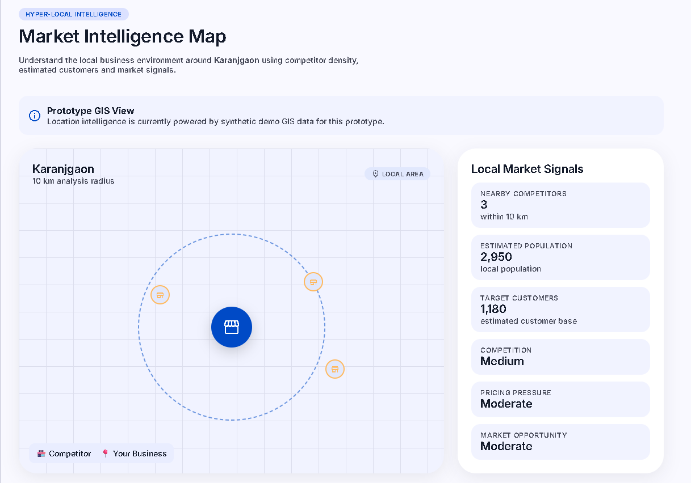
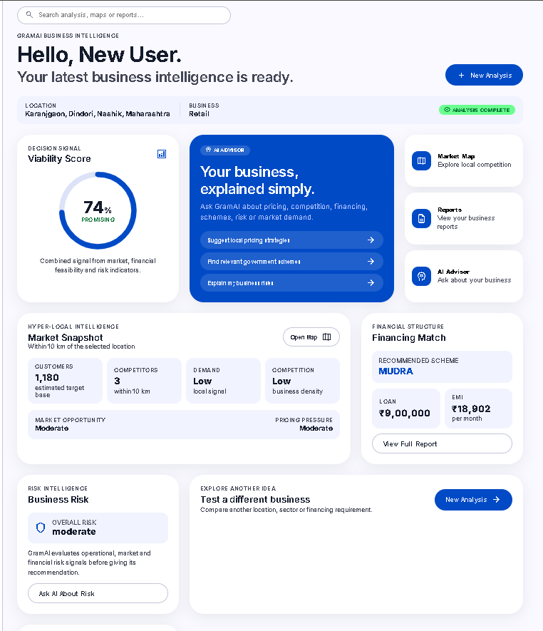
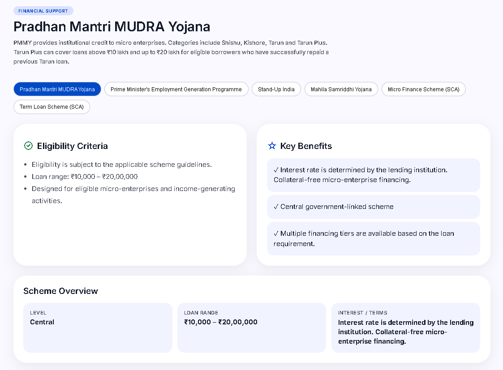
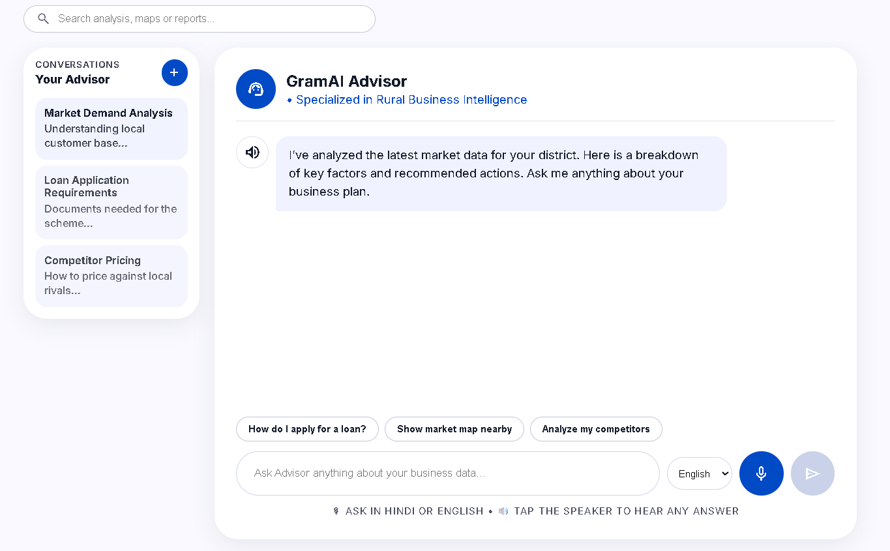
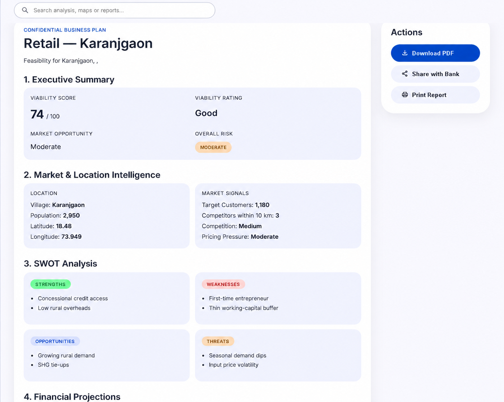

# GramAI

## AI-Powered Hyper-Local Business Advisory & Financial Intelligence Platform

GramAI is an AI-powered decision-support platform designed to help rural entrepreneurs evaluate and plan a business using hyper-local market intelligence, financial analysis, government scheme matching, risk assessment, and personalized AI guidance in one place.

The platform is designed around a simple principle:

> Data → Intelligence → Advice

Instead of relying on a chatbot alone, GramAI combines deterministic business logic with AI so that important calculations and decision signals are generated by the backend, while the AI Advisor explains the results in a simple conversational way.

---

## Overview

Rural entrepreneurs often have limited access to timely and contextual business guidance. Important decisions such as:

- What business should I start?
- Is there enough local demand?
- How much competition exists nearby?
- How much money will I need?
- How much should I invest myself?
- How much loan may be required?
- What will the EMI look like?
- Which government schemes may apply?
- What are the major business risks?

are often answered using fragmented information or informal guidance.

GramAI brings these areas together into a single platform.

The user provides a location, business category, and financial requirements. GramAI processes this information through multiple intelligence engines and produces a structured business analysis.

---

# Key Capabilities

- Hyper-local market intelligence
- Local competition analysis
- Market Map visualization
- Financial and loan planning
- EMI and repayment calculation
- Business viability scoring
- Business risk assessment
- Government scheme matching
- Applicant-profile based scheme personalization
- AI-powered Business Advisor
- English, Hindi and Hinglish conversational interaction
- Voice input
- RAG-lite knowledge retrieval
- Structured business reports
- PDF report generation
- Real-time analysis progress using SSE
- Persistent analysis and report history

---

# Core Capabilities

## 1. Hyper-Local Market Intelligence

GramAI evaluates the selected business within its local context.

The market analysis can consider:

- Estimated customer base
- Local demand
- Market opportunity
- Competition density
- Pricing pressure
- Selected location
- Business category

The goal is to move from generic business advice to location-aware business intelligence.

---

## 2. Competition Analysis

GramAI analyzes nearby competition within the selected market area.

The prototype uses controlled/demo competitor data to demonstrate:

- Number of competitors
- Competition density
- Nearby business locations
- Market competition signals

This information is also visualized through the Market Map.

---

## 3. Market Map

The Market Map provides a visual representation of the selected business location and nearby competitors.

It helps the entrepreneur understand:

- Selected business location
- Nearby competitors
- Approximate market area
- Competition distribution
- Local market signals

The current prototype uses a custom map-style visualization with controlled/demo location data.



---

## 4. Financial Intelligence

GramAI provides structured financial planning based on the entrepreneur's requirements.

The financial engine handles calculations such as:

- Project cost
- Own contribution / margin
- Loan requirement
- Interest rate
- Loan tenure
- Moratorium
- EMI
- Repayment planning
- Financial feasibility

The core financial calculations are performed by the backend financial engine rather than being generated by the LLM.

---

## 5. Viability & Risk Assessment

GramAI combines multiple decision signals to produce a business viability assessment.

The decision logic considers factors such as:

- Market demand
- Competition
- Financial feasibility
- Business risk

The resulting Viability Score is intended to give the entrepreneur a simple high-level signal before making further business decisions.

Risk intelligence provides a structured view of potential operational, market and financial risks.



---

## 6. Government Scheme Matching

GramAI matches business requirements and applicant information with configured government scheme criteria.

The system can use applicant attributes such as:

- Woman entrepreneur
- SC/ST category
- Previous Tarun loan repayment
- Business/sector type
- Project cost
- Loan requirement

The prototype provides preliminary scheme matches and displays relevant eligibility information and benefits.

Government scheme eligibility should always be verified against the latest official guidelines before making an application.



---

## 7. Personalized AI Advisor

The AI Advisor provides conversational guidance based on the business analysis.

Users can ask questions about:

- Business feasibility
- Pricing
- Competition
- Financing
- EMI and loans
- Government schemes
- Market demand
- Business risks
- Working capital
- Viability results

The Advisor uses the available analysis context so that responses can be related to the entrepreneur's specific business scenario.



---

## 8. Multilingual & Voice Interaction

GramAI is designed to make business guidance easier to access for users who may prefer regional or conversational communication.

The current prototype supports:

- English
- Hindi
- Hinglish-style interaction
- Voice input through the browser Speech Recognition API

The production roadmap includes broader regional-language support and more complete voice-first interaction.

---

## 9. RAG-Lite Knowledge Retrieval

The AI Advisor can use a lightweight retrieval layer to provide relevant contextual information.

The current prototype uses a RAG-lite / controlled knowledge approach, rather than a full production-scale vector database and document-ingestion pipeline.

The production architecture can be extended with:

- Official government documents
- Scheme guidelines
- Market datasets
- Business knowledge
- Embeddings
- Vector database
- Source and date tracking

---

## 10. Business Reports

GramAI converts the analysis into a structured business report containing information such as:

- Viability
- Market analysis
- Competition
- Financial structure
- Pricing recommendations
- Risk assessment
- SWOT analysis
- Government scheme matches
- Key assumptions

Reports can be generated as PDF documents for further planning and verification.



---

# System Architecture

```text
                    Rural Entrepreneur
                           |
                  Voice / Text / Input
                           |
                           v
              React + TypeScript Frontend
                           |
                    REST API / SSE
                           |
                           v
                    FastAPI Backend
                           |
          +----------------+----------------+
          |                |                |
          v                v                v
    Market / GIS       Financial        Scheme / RAG
       Engine            Engine            Engine
          |                |                |
          +----------------+----------------+
                           |
                           v
                    Decision Engine
             +-------------+-------------+
             |             |             |
          Demand       Financial      Competition
             |             |             |
             +-------------+-------------+
                           |
                           v
                  Viability & Risk
                           |
                           v
                    AI Advisor
                  LLM + Context
                           |
                           v
                   Report Generator
                           |
                           v
                      PDF Report
```

### Core Design Principle

**Deterministic systems calculate. AI explains and personalizes.**

Financial calculations, scheme matching logic, competition estimation and viability signals are handled by backend services and decision logic.

The LLM is used primarily for natural-language interaction, contextual explanation and personalized guidance.

---

# Technology Stack

## Frontend

- React.js
- TypeScript
- Vite
- CSS
- Axios

## Backend

- Python
- FastAPI
- Uvicorn
- Pydantic

## Database

- SQLite
- SQLAlchemy

## Authentication

- JWT-based authentication

## AI & Intelligence

- LLM-based AI Advisor
- RAG-lite / contextual retrieval
- Rule-based and deterministic business logic

## Business Intelligence Engines

- Market Intelligence Engine
- Competition Analysis Engine
- Financial / Loan Engine
- Government Scheme Matching Service
- Viability Engine
- Risk Assessment Logic

## Voice

- Browser Speech Recognition API
- Hindi / English language recognition

## Reports

- ReportLab
- PDF generation

## Real-Time Processing

- Server-Sent Events (SSE)

## Location & Visualization

- Custom Market Map
- Controlled/demo location and competitor data

---

# Project Structure

```text
GramAI/
|
+-- backend/
|   +-- app/
|   |   +-- api/
|   |   +-- agents/
|   |   +-- finance/
|   |   +-- services/
|   |   +-- db.py
|   |   +-- main.py
|   |
|   +-- requirements.txt
|   +-- ...
|
+-- frontend/
|   +-- src/
|   |   +-- components/
|   |   +-- pages/
|   |   +-- dashboardApi.ts
|   |   +-- App.tsx
|   +-- package.json
|   +-- ...
|
+-- docs/
|   +-- screenshots/
|       +-- dashboard.png
|       +-- market-map.png
|       +-- schemes.png
|       +-- advisor.png
|       +-- report.png
|
+-- .gitignore
+-- README.md
```

---

# Prerequisites

Make sure the following are installed:

- Python 3.11
- Node.js LTS
- npm
- Git

Recommended development environment:

- Windows
- VS Code
- Conda environment

---

# Installation

## 1. Clone the Repository

```bash
git clone https://github.com/ridamgupta79-dev/GramAI.git
cd GramAI
```

---

## 2. Backend Setup

Activate the project environment:

```bash
conda activate gramai
```

Install backend dependencies:

```bash
pip install -r backend/requirements.txt
```

---

## 3. Frontend Setup

Move into the frontend directory:

```bash
cd frontend
```

Install dependencies:

```bash
npm install
```

---

# Environment Configuration

Create a local environment file if required by the configured AI services:

```text
.env
```

Do not commit secrets or API keys to GitHub.

A shareable environment template can be maintained as:

```text
.env.example
```

---

# Running the Application

## Start Backend

From the project root:

```bash
uvicorn app.main:app --reload --app-dir backend
```

The backend will be available at:

```text
http://localhost:8000
```

Swagger API documentation:

```text
http://localhost:8000/docs
```

---

## Start Frontend

Open another terminal:

```bash
cd frontend
npm run dev
```

The frontend will normally be available at:

```text
http://localhost:5173
```

---

# Core Application Flow

```text
1. User selects location
          |
2. User selects business category
          |
3. User enters financing requirements
          |
4. GramAI starts analysis
          |
5. Market intelligence
          |
6. Competition analysis
          |
7. Financial feasibility
          |
8. Scheme eligibility matching
          |
9. Viability & risk assessment
          |
10. AI advisory insights
          |
11. Dashboard results
          |
12. PDF business report
```

The analysis pipeline provides stage-wise progress using Server-Sent Events.

---

# API Architecture

The backend is organized around API modules for major platform capabilities.

Key areas include:

```text
/api/auth
/api/v1/dashboard
/api/analysis
/api/reports
/api/schemes
/api/locations
```

The exact available endpoints may evolve as the prototype is developed further.

---

# Data & Prototype Approach

The current prototype uses a controlled/demo data approach to demonstrate the complete GramAI workflow.

Data and inputs include:

- User-provided business information
- User-selected locations
- Seeded location information
- Controlled competitor/market scenarios
- Configured government scheme information
- Application-level business rules
- Financial inputs

The prototype does not currently represent a complete live national data integration layer.

Potential production data integrations include:

- Government scheme sources
- Agmarknet and market data
- OpenStreetMap / geospatial data
- NABARD resources
- RBI financial information
- Other verified public datasets

These integrations are part of the future production roadmap.

---

# Current Implementation Status

## Implemented in Prototype

- React + Vite frontend
- FastAPI backend
- User authentication flow
- Location selection
- Business analysis workflow
- Hyper-local market analysis
- Competition analysis
- Market Map
- Financial calculations
- Loan planning
- EMI calculation
- Viability Score
- Business risk assessment
- Government scheme matching
- Applicant-profile based scheme matching
- AI Advisor
- English / Hindi / Hinglish interaction
- Voice input
- RAG-lite contextual retrieval
- SSE analysis progress
- PDF report generation
- Reports page
- Persistent analysis/report history
- Dashboard restoration after refresh

---

# Current Limitations

The current version is a functional prototype and has several limitations.

### Data

- Market and competitor information is controlled/demo data.
- Live Agmarknet integration is not currently implemented.
- Live government API integration is not currently implemented.
- National-scale datasets are not yet integrated.

### AI

- The current knowledge retrieval layer is RAG-lite.
- A production-scale embedding/vector database pipeline is not yet implemented.
- Fully offline/local AI is not currently implemented.
- Multilingual support can be expanded further.

### Financial Features

The current prototype focuses on financial structuring and feasibility, including:

- Project cost
- Own contribution
- Loan amount
- Interest
- Tenure
- EMI
- Repayment planning

A complete day-to-day financial ledger and transaction-record system is part of the future roadmap.

### Infrastructure

- SQLite is used for the prototype.
- Production deployment can migrate to PostgreSQL.
- The current analysis worker is designed for prototype use.
- Production-scale distributed processing can use dedicated workers and infrastructure.

### Integrations

The following are future integrations:

- WhatsApp / Telegram
- Banking integrations
- Offline synchronization
- Live government and market data
- Production cloud infrastructure

---

# Roadmap

## Phase 1 — Prototype

- Working business analysis
- Market intelligence
- Competition analysis
- Financial planning
- Scheme matching
- AI Advisor
- Voice input
- Market Map
- PDF reporting

## Phase 2 — Production Intelligence

- Live market data integration
- Verified government scheme knowledge base
- Full RAG pipeline
- Vector database
- Source/date tracking
- Better geospatial intelligence
- Improved viability models

## Phase 3 — Rural-First Experience

- Full voice-first workflow
- Regional language expansion
- Offline-first architecture
- Lightweight/local AI models
- Low-bandwidth optimization
- Voice-based financial records

## Phase 4 — Ecosystem Integration

- WhatsApp / Telegram support
- Banking and financing integrations
- Application assistance
- Business progress tracking
- Financial identity building
- Large-scale cloud deployment

---

# Responsible Use

GramAI is designed as a decision-support system, not a replacement for professional financial, legal or government-authority verification.

AI-generated recommendations may contain errors.

For important decisions:

```text
Record → Prompt → Verify → Decide
```

Financial calculations should be checked against the user's actual financial terms.

Government scheme eligibility should be verified against the latest official scheme guidelines before application.

Market insights are dependent on the quality, coverage and freshness of the underlying data.

---

# Prototype Screenshots

## Dashboard


## Market Map


## Government Schemes


## AI Advisor


## Business Report


---

# Future Vision

GramAI aims to become a rural-first business intelligence platform that helps entrepreneurs move from:

```text
Business Idea
      |
Local Market Understanding
      |
Financial Planning
      |
Risk & Viability Assessment
      |
Government Scheme Discovery
      |
Personalized AI Guidance
      |
Actionable Business Plan
```

The long-term vision is to make reliable business intelligence and financial guidance more accessible to rural entrepreneurs, even in environments with limited connectivity, limited digital literacy and limited access to professional advisory services.

---

# Author

**Ridam Gupta**

AI/ML-focused developer building GramAI as a rural business intelligence and decision-support platform.

---

# Project

**GramAI — AI-Powered Hyper-Local Business Advisory & Financial Intelligence**

Built as an AI/ML and full-stack project focused on rural entrepreneurship, business intelligence, financial planning and accessible decision support.

---

# Screenshots

All project screenshots are stored in:

```text
docs/screenshots/
```

Current screenshot files:

```text
dashboard.png
market-map.png
schemes.png
advisor.png
report.png
```

---

## License

This project is currently developed as a hackathon/prototype project.
